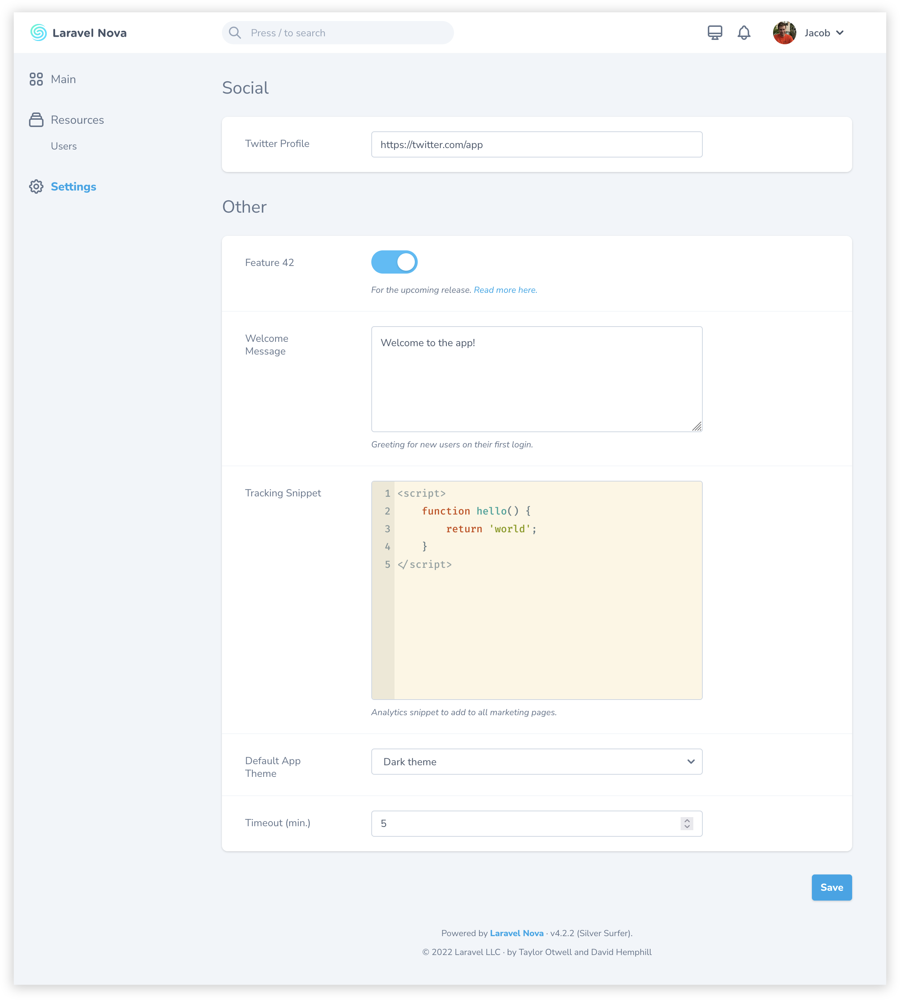

Laravel Nova tool to manage app settings
========================================

[](https://packagist.org/packages/masoudi/nova-settings-tool)
[](https://packagist.org/packages/masoudi/nova-settings-tool)
[](https://opensource.org/licenses/MIT)

This package based on [bakerkretzmar/nova-settings-tool](https://github.com/bakerkretzmar/nova-settings-tool)



## Installation

Install the package via Composer in any Laravel app using [Nova](https://nova.laravel.com):

```bash
composer require masoudi/nova-settings-tool
```

> Nova Settings Tool v2 requires Nova 4—for older versions of Nova, use v1 of this package.

Publish the default configuration file to `config/nova-settings-tool.php`:

```bash
php artisan vendor:publish --tag="nova-settings-tool"
```

Register the tool with Nova in the `tools` method of your `NovaServiceProvider`:

```php
// in app/Providers/NovaServiceProvider.php

use Masoudi\Nova\Tool\SettingsTool;

    // ...

    public function tools()
    {
        return [
            new SettingsTool,
        ];
    }
```

## Usage

Settings are declared in a `nova-settings-tool.php` config file. This file specifies where settings are stored, what the tool’s title is in Nova’s sidebar, the layout of the settings page, and metadata about the settings themselves.

A [default config file with some helpful examples](config/nova-settings-tool.php) is included as a starting point:

Each item in the `settings` array is rendered as an input with a label and help text, similar to one of Nova’s fields. Settings can also be grouped into panels, to separate them visually.

The settings’ actual values are stored as JSON at the location specified in the config file—`storage/app/settings.json` by default.

There are currently six available setting types:

- `text`: Single-line text input
- `textarea`: Multi-line text input
- `toggle`: Boolean switch
- `code`: [CodeMirror](https://codemirror.net/) text editor
- `number`: Number input
- `select`: Single-select dropdown

All strings in this package, and any you pass to it, can easily be translated using [Laravel’s built-in localization features](https://laravel.com/docs/localization#using-translation-strings-as-keys). Also all labels, helps, placeholders and options translated by language json file in `lang` directory

This tool also fires an event any time any settings are changed, with all the old and new settings attached.

## Roadmap

The following features are planned or in development:

- `color` setting type
- `date` setting type
- `file` setting type
- setting validation

---
[LICENSE](LICENSE.md)
